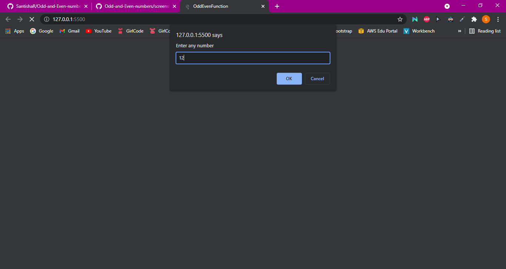
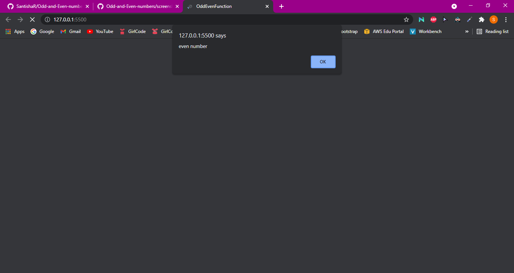
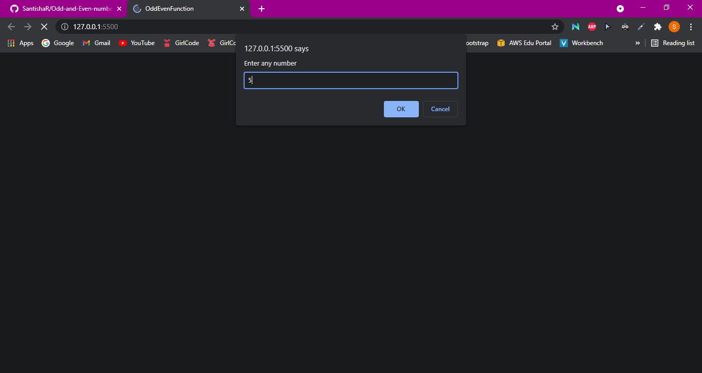
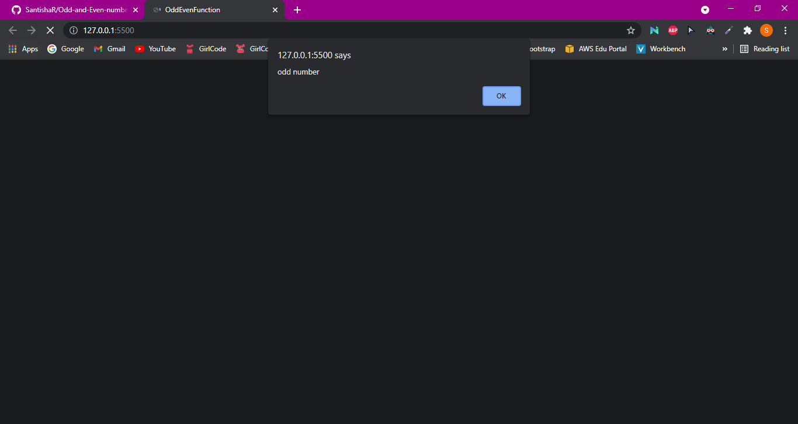

# Odd-and-Even-numbers

In this project I created a simple function to find even and odd numbers. I used a prompt in which the user can input a number and an alert will show the outcome.

## Project Screenshots

## Languages Used

- HTML
- Javascript

## License

[MIT](https://choosealicense.com/licenses/mit/)

## Authors

- Santisha Reddy
